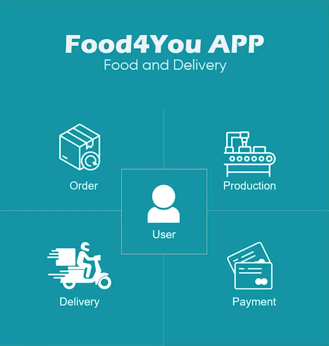

## Decoder Week 03/2023:
* https://www.decoderproject.com/criacao-arquitetura-microservices

### 13/03 - Modelagem Arquitetura de Microservices da Michelli Brito
* Aprenda a modelar uma Arquitetura de Microservices utilizando o ecossitema Spring, desde seus microservices de negócios até os seus microservices de configurações e muito mais...
* MS de Negócio:
  * Divisão e granularidade dos MS.
  * Isolamento / Acoplamento.
  * Base de dados compartilhada e por MS.
* MS de Configurações:
  * API Gateway.
  * Service Registry.
  * Global Config.
* Maturidade da Arquitetura:
  * Observabilidade utilizando de Log Aggregation.
  * Rastreamento distribuído.
  * Métricas.
  * Resiliência com Circuit Breaker.
  * Autenticação / Autorização.
* Conteúdo:
  * Evolução Arquitetural:
    * sistema monolitico: frontend + backend.
    * sistema monolitico: frontend e backend porem separados.
    * arquitetura de microservices: vários serviços, cada um com sua própria responsabilidade, trabalhando de forma independente e se comunicando entre si com base de dados separadas.
    * arquitetura de micro frontends + microservices.
  * Arquitetura de MS veio como uma solução à limitações dos sistemas monolíticos.
  * Principais Benéficios dos MS's:
    * Melhor Manutenibilidade: Contextos menores, mais organizados.
    * Alta Disponibilidade.
    * Flexibilidade Tecnológica: Soluções adequadas para cada caso.
    * Independência das Equipes.
    * Melhor Performance.
    * Divisão da Complexidade do Negócio.
    * Isolamento e Falhas: Conseguimos fazer a correção de maneira pontual.
    * Alta Escalabilidade: E controle, pois podemos escalar apenas alguns serviços e não todos.
    * Baixo Acoplamento: Dividir pra conquistar, buscar sempre o maior isolamento possível.
    * Melhor Testabilidade.
    * Agilidade nas Mudanças: Mais fácil pra atualizar versões, sem se preocupar com efeitos colaterais.
    * Isolamento Modelagem Dados: Cada serviço pode ter seu banco.
    * Aumento Resiliência.
  * Arquitetura de Microservices é um modelo evolutivo, modelo que mais facilmente se adapta as mudanças dos negócios e as modernizações tecnológicas.
* Estudo de Caso:
  * 
  * Divisão do Negócio em Microservices:
    * OrderService.
    * ProductionService.
    * DeliveryService.
    * PaymentService.
    * UserService.
* Granularidade dos Microservices:
  * Tomar cuidado para não fazermos micro ou nano ms. Exemplo:
    * OrderService.
    * ProductionService: KitcherService, PreparationService e PackaginService.
    * DeliveryService.
    * PaymentService: PagSeguroService e PaypalService.
    * UserService.
* Cada um dos MS serão compostos pelo SpringBoot, pois o mesmo tem toda a arquitetura do Spring Framework + Servidor Embutido (Tomcat ou Netty) - Toda burocracia de configuração, ou seja, não precisamos nos preopucar com arquivos de XML<bean> Configuration ou @Configutarion.
* continuar -49:50

### 14/03 - Comunicações entre Microservices
### 15/03 - Microservices Patterns
